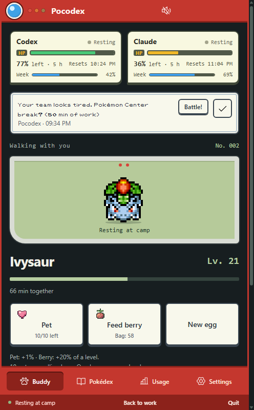
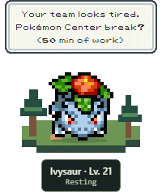
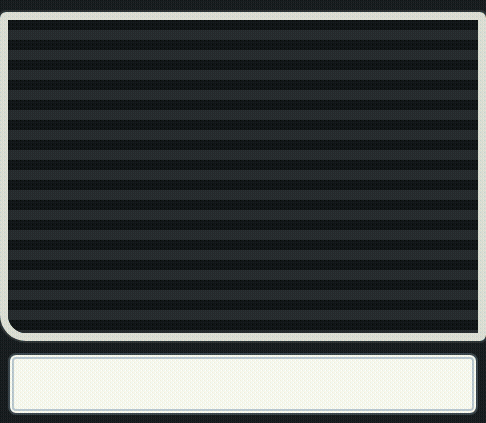
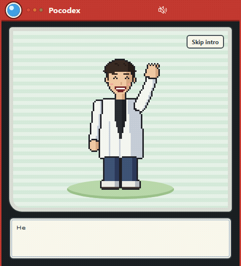
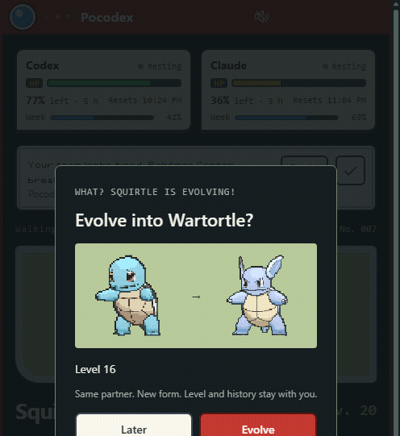
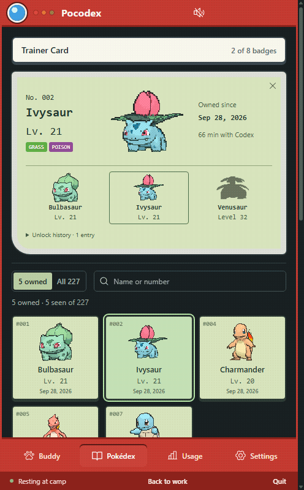
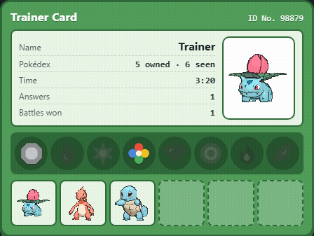

# Pocodex

A Pokémon buddy for your Windows desktop that grows while your coding agents work. It follows the Codex desktop app and Claude Code, reacts when either finishes or needs you, and shows how much of each app's allowance is left.

  

Free, unofficial, Windows x64 only. No API key or account needed.

## Install

Pocodex is not published as a download. You build it on your own PC, and the build fetches the Pokémon sprites and cries from their public sources. You need Windows x64, [Git](https://git-scm.com/download/win), [Python 3.12 or later](https://www.python.org/downloads/) and [Node 24](https://nodejs.org/).

### Ask your coding assistant

Paste this into Codex or Claude Code on Windows:

```text
Install Pocodex on this Windows PC from source: https://github.com/lighteternal/Pocodex

1. Use native Windows PowerShell, not WSL. Check that git, Python 3.12 or later and Node 24 are installed. If one is missing, tell me what to install and stop.
2. Clone the repository into %USERPROFILE%\Pocodex, or run git pull there if it already exists.
3. Follow the "Build it yourself" steps in its README. The build runs the tests and writes an installer to artifacts\companion. If a step fails, show me the error and stop; do not change the code.
4. Run the newest "Pocodex Setup <version>.exe" in artifacts\companion and tell me when Pocodex is open.

Do not edit my Codex or Claude Code settings yourself. Pocodex asks me which apps to follow in its first-run intro.
```

### Build it yourself

In PowerShell:

```powershell
git clone https://github.com/lighteternal/Pocodex.git
cd Pocodex
python -m venv .venv
.venv\Scripts\python.exe -m pip install -e ".[build]"
npm ci --prefix companion
.venv\Scripts\python.exe scripts/build_companion.py
```

The build runs every unit test, then writes `Pocodex Setup <version>.exe` and a portable ZIP to `artifacts\companion`.

1. Run the installer. It installs for your Windows user without administrator rights, then opens Pocodex.
2. Professor Tibo explains the basics. Tick the apps Pocodex should follow, tell him your name and choose **Start with an egg**. Settings can replay his intro.



For the portable ZIP instead, extract the whole folder somewhere permanent and run `Pocodex.exe`.

### Update or uninstall

To update, run `git pull` in the Pocodex folder, then the last three commands above, and run the new installer over the old one. Your collection is kept.

To uninstall, use Windows Settings > Apps > Installed apps > Pocodex. That removes the Claude Code entries Pocodex added and keeps your collection in `%APPDATA%\Pocodex`.

## Connecting your apps

| App | What Pocodex reads | What it changes |
| --- | --- | --- |
| Codex desktop app | New lines in Codex's session logs (`%USERPROFILE%\.codex\sessions`, or `CODEX_HOME`) | Nothing |
| Claude Code (desktop app, terminal or VS Code) | Its own hook records and status-line snapshot | Adds hooks and a status line to `%USERPROFILE%\.claude\settings.json` |

Claude Code sessions that run inside WSL, including desktop-app sessions in a WSL folder, use the distro's own `~/.claude` and aren't followed yet.

Pocodex only edits Claude Code's settings after you tick Claude Code. Every entry it adds carries the argument `--pocodex`, so unticking it in Settings, or uninstalling Pocodex, removes exactly those entries and puts back your own status line if you had one. It keeps a one-time copy as `settings.json.pocodex-backup`. If the file isn't plain JSON, Pocodex leaves it alone and shows the snippet to paste by hand.

The hooks run asynchronously, so Claude Code never waits for Pocodex. They record which event happened, the session, the project folder name and the transcript path. They never store your prompt or the questions Claude asks you: with message previews on, Pocodex reads a question from the session's transcript, like an answer.

## Growing and reacting

- An egg hatches after two minutes of observed work. Pick one of three Pokémon, or ask for three more.
- Each app earns XP for its own working time: when Codex and Claude Code both work, your Pokémon grows twice as fast. Several chats inside one app still count once.
- Time-based rules about you count wall-clock time once, however many apps are busy: the 50-minute stretch reminder, "Active today" and the daily bonus.
- Level-ups earn berries. Feed one for 20% of a level; pet up to ten times an hour for 1% each.
- Evolution is offered, never forced. Item and trade evolutions use a labelled solo alternative.
- The buddy walks while work runs, naps after ten idle seconds, and shows a question mark when an app needs you. A small Pokégear notice appears above it with the answer or question, without taking focus.

 

## Battles and the Trainer Card

Take a break with a wild battle: "Look for wild Pokémon" on Home, or accept the offer in the 50-minute stretch reminder. Your partner fights with its real level-up moves and base stats, the damage and catch rules follow the games' formulas, and a win or a catch earns XP and a Poké Ball. Caught Pokémon join your Pokédex at their level. Five battles a day keep it a break.



Eight Gym Badges mark milestones, from hatching your first Pokémon to growing one with both Codex and Claude Code. Your Trainer Card (Pokédex > Trainer Card) collects them with your party and records, changes colour as badges add up, and can be copied or saved as an image to share. [How battles and badges work](docs/design/battles-and-trainer-card.md).

## How much is left

Home opens on two battle-style boxes, one per app. HP is the five-hour window, the thin blue bar is the week, and the colours follow the games: green, yellow from half, red from a fifth.

- **Codex:** from usage snapshots Codex writes to its session logs.
- **Claude Code:** live from the status line Pocodex adds, which only terminal sessions run. The Claude desktop app runs Claude Code without a status line, so by default Pocodex only shows a limit once you hit it: the box drops to zero with the exact reset time Claude Code logs, then clears when the window resets. For live numbers there, turn on **Check Claude's usage with Claude Code** in Settings: every 10 minutes Pocodex runs your Windows Claude Code hidden, reads its `/usage` screen and removes the session. That spends no tokens (the check runs with hooks off and a model name that does not exist, so nothing can reach a model), and it needs Claude Code installed on Windows and signed in.

Numbers are only shown when observed. A box explains missing data instead of showing zero, and marks old readings with their age.

## Settings worth knowing

- **Connections:** turn each app on or off, see when it last reported, and check again after installing one.
- **Show message previews:** on by default. The start of an answer or a question appears in notices. Excerpts stay in memory, are never saved or uploaded, and are cleared when you turn previews off.
- **Open when the Codex app starts:** optional. A small watcher checks every two seconds whether the Codex desktop app is running.
- **Quiet mode, Reduce motion, Keep buddy on top, sounds and scenery:** each independent. Cries only play on events, never at random.
- **Quit completely** (footer, tray or right-click on the buddy) stops everything, including the startup watcher.

## Data and privacy

Everything stays on your PC. Pocodex makes no network requests at runtime, calls no models and uses no tokens.

- Your collection: `%APPDATA%\Pocodex\companion.sqlite`. To back it up, quit Pocodex and copy the `%APPDATA%\Pocodex` folder. Uninstalling keeps it.
- Claude Code records: `claude-inbox.jsonl` (trimmed after reading) and `claude-limits.json` in the same folder.
- Token counts come from local records. Cached input is part of input. Tokens are not your plan's allowance and are not assigned to individual tasks.
- XP measures observed working time, not effort or productivity. After 120 seconds without activity, time stops counting, which can undercount long silent tasks.

## If something does not work

| Symptom | Check |
| --- | --- |
| No buddy | Open Pocodex from Start. Turn on Settings > Keep buddy on top. Check the tray icon's Show buddy. |
| Egg does not change | Settings > Connections should say Connected. Only work after Pocodex started counts. |
| Claude allowance box stays empty | Normal for the desktop app. Run a Claude Code session in a terminal once. |
| "Couldn't read your Claude Code settings" | The file has comments or another non-JSON shape. Paste the snippet from Settings > Connections into it by hand. |
| No alert for a Codex approval dialog | Codex does not record those dialogs. Questions and finished answers are supported. |
| No sound | Check mute, Quiet mode and the sound switches. |

For an isolated trial: `Pocodex.exe --profile="C:\trial\profile" --source="C:\trial\codex" --claude-config="C:\trial\claude" --show-home`.

## Build and test

See [Development](docs/DEVELOPMENT.md) for build commands and [Testing](docs/TESTING.md) for what each test layer covers. Design notes: [connecting both apps](docs/design/unified-tracking.md) and [battles and the Trainer Card](docs/design/battles-and-trainer-card.md).

## Fan-project notice

Pocodex is a free, non-commercial hobby project. It charges nothing, shows no ads and accepts no payments.

It is unofficial and not affiliated with, endorsed by or sponsored by Nintendo, The Pokémon Company, Game Freak, Creatures, OpenAI, Anthropic or PokeTokenBar. Pokémon characters, artwork, cries, names and trademarks belong to their owners, and no ownership is claimed. Professor Tibo is Pocodex's own pixel art and a friendly nod to Tibo Sottiaux of OpenAI's Codex team; he has not endorsed Pocodex.

Original Pocodex code is [MIT-licensed](LICENSE); that licence does not cover Pokémon material. This repository does not contain the Pokémon sprites or cries; builds download them from the sources in the [third-party notices](companion/THIRD-PARTY-NOTICES.md). Rights holders can ask for removal through GitHub.
